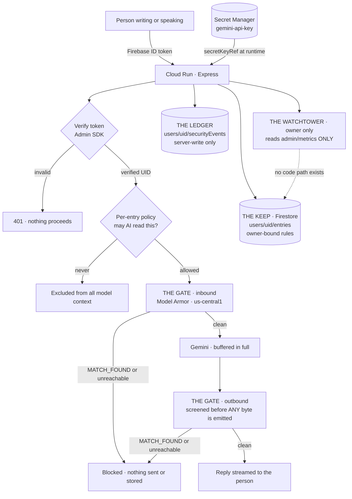

# ThoughtKeep

*The safest room for your thoughts.*

**[Live app](https://thoughtkeep-app-757214291617.asia-southeast1.run.app/)** · **[Demo video](https://youtu.be/o9OzDaAQxck)** · Built for the Google Gen AI Academy APAC Cohort 3 Ideathon

---

## The problem

Most AI applications look convincing in a demo and come apart in production. Keys end up in client bundles. Identity is taken on trust from the browser. Everybody's data sits in one collection with a filter on the screen standing in for a security boundary.

ThoughtKeep was built the other way round: the security model was designed first, and the product was built inside it. Every claim below is backed by a test in [`docs/security-evidence.md`](docs/security-evidence.md).

## What it does

ThoughtKeep is a private AI journal. You write — or speak — about your day in whatever language comes naturally, and Gemini responds as a reflective companion rather than an assistant waiting for instructions. Entries are saved under your own identity, and you decide per entry whether the AI may read it at all and how long it should be kept.

Underneath, every message is screened in both directions before it reaches the model or comes back to you, every security decision is written to an audit trail you can read yourself, and the person who runs the service cannot read a single word you write.

## Architecture



**The request path.** The browser sends a Firebase ID token with every call. The server verifies it with the Admin SDK and derives the user's identity from the verified token alone — never from a body, header or query string. The entry's own privacy policy is checked next; an entry marked *never send to AI* is excluded before anything else happens. What remains passes through The Gate into Gemini, and the reply is buffered **in full** and screened again before a single byte reaches the browser.

Note the dotted line: The Watchtower has **no code path** to user content. That absence is the control, and a test enforces it.

## The four required capabilities

| Requirement | How ThoughtKeep implements it |
|---|---|
| **Firebase Authentication** | Google Sign-In only. Every request carries an ID token verified server-side with the Firebase Admin SDK, which validates signature and standard claims against Google's rotating keys *before* exposing any claim. Two further checks then apply: `email_verified` must be true, and the provider must be `google.com`. The UID is derived from the verified token and nowhere else. |
| **Multi-turn Gemini** | Real conversational memory across turns, in any language the person writes in, following mid-conversation switches without remarking on them. Context is capped and entries marked *never send to AI* are filtered out before the model sees anything. |
| **User-isolated Firestore** | Every entry lives at `users/{uid}/entries/{entryId}`. Firestore Security Rules enforce `request.auth.uid == userId`, with a terminal default-deny. Isolation is enforced *at the database*, not by filtering the screen. |
| **Secret Manager** | The Gemini key is injected at runtime via `secretKeyRef` from Secret Manager. It appears in no source file, no config, no log and no browser bundle. Verifiable: `gcloud run services describe thoughtkeep-app --region asia-southeast1 --format="yaml(spec.template.spec.containers[0].env)"` |

## Original features

Five things the brief did not ask for.

- **The Gate** — every prompt *and* every model response screened by Google Cloud Model Armor for prompt injection, jailbreaks, harmful content, malicious links and sensitive data. It **fails closed**: if Model Armor is unreachable, slow, or answers in an unexpected shape, the message is blocked rather than passed through unscreened. This was proved by deliberately breaking the configuration and confirming a harmless message was refused (test T20).
- **The Ledger** — a per-user security audit trail. Written only by the backend; the published rules give the user read access and deny writes outright. An audit log its own subject can edit is not evidence of anything.
- **Lingua** — write or speak in any language Gemini supports, switch mid-conversation, and hear replies read back in Google Cloud Chirp 3 HD voices. If a browser lacks speech support the controls remove themselves entirely rather than presenting a button that does nothing.
- **The Companion** — an optional self-described role shapes the *style* of assistance. It is sanitised on write and again on read; instruction-shaped values are rejected rather than cleaned. **Role is not permission** — it unlocks nothing, and nine tests prove it.
- **Governance** — per entry, decide whether the AI may read it and how long it is kept (7 / 30 / 365 days or indefinitely, via Firestore TTL). Plus one-click export of everything held about you, and irreversible erasure of all of it.

## Security

| Document | What it contains |
|---|---|
| [`docs/security-constitution.md`](docs/security-constitution.md) | The sixteen directives every line of this codebase was written under |
| [`docs/threat-model.md`](docs/threat-model.md) | Threats, the control that stops each, and the test that proves it |
| [`docs/security-evidence.md`](docs/security-evidence.md) | **23 attacks run against the live deployment, plus 12 findings discovered and fixed** |
| [`firestore.rules`](firestore.rules) | The published rules, including why no wildcard covers the audit trail |

**On the evidence document.** It records what actually happened, including tests that initially failed and the twelve defects found during development — among them outbound screening that ran after content had already been streamed, Firestore rules defeated by an overlapping wildcard, and a spending counter silently reset by an unrelated write. A security document in which everything passed first time is not a stronger document; it is a less honest one.

**No absolute claims are made.** Nothing here says unhackable, impossible to breach, or 100% secure. What is documented is what is controlled, how, and what was tested.

## Deliberate trade-offs

[`docs/trade-offs.md`](docs/trade-offs.md) — what was deliberately *not* built, and the reasoning. Includes the decision not to build user-to-user sharing, because every sharing feature is a hole in the isolation guarantee.

## Future work

[`docs/future-work.md`](docs/future-work.md) — the v2 roadmap.

## Verification

Everything below is reproducible.

```bash
npm install
npm run lint     # TypeScript, zero errors
npm test         # 64 tests, including negative cases for every control
npm run build
```

Confirm no Gemini key exists anywhere in the repository:

```bash
grep -rn "AIza" . --exclude-dir=.git --exclude=package-lock.json
```

The `AIza...` matches found by this check are Firebase **Web** API-key references, including the frontend Firebase configuration and generated browser bundle. That key identifies the project to Firebase services; access is controlled by Authentication and Firestore Rules. It is a different credential from the Gemini key, which is server-side only and supplied through Secret Manager.

## Running it yourself

1. Create a Firebase project with Google Sign-In enabled and a Firestore database named `(default)`.
2. Publish `firestore.rules` to that database, replacing the owner UID in `isAdmin()` with your own.
3. Create a Model Armor template named `thoughtkeep-gate` in `us-central1` with the RAI, prompt-injection, sensitive-data and malicious-URI filters enabled.
4. Store your Gemini API key in Secret Manager as `gemini-api-key`.
5. Grant the Cloud Run runtime service account `roles/secretmanager.secretAccessor`, `roles/datastore.user` and `roles/modelarmor.user`.
6. Deploy:

```bash
gcloud run deploy thoughtkeep-app --source . \
  --region asia-southeast1 --allow-unauthenticated \
  --set-env-vars NODE_ENV=production,FIREBASE_PROJECT_ID=YOUR_PROJECT,MODEL_ARMOR_LOCATION=us-central1,MODEL_ARMOR_TEMPLATE=thoughtkeep-gate,OWNER_UID=YOUR_UID \
  --set-secrets GEMINI_API_KEY=gemini-api-key:latest
```

7. Add the resulting Cloud Run hostname to Firebase Authentication → Settings → Authorized domains.
8. Enable Firestore TTL so retention policies take effect:

```bash
gcloud firestore fields ttls update expiresAt --collection-group=entries --enable-ttl
```

## Built with

Cloud Run · Firebase Authentication · Cloud Firestore · Gemini API · Google Cloud Model Armor · Secret Manager · Cloud Text-to-Speech (Chirp 3 HD) · React · TypeScript · Express

---

*ThoughtKeep was built for the Google Gen AI Academy APAC Edition, Cohort 3 Ideathon.*
